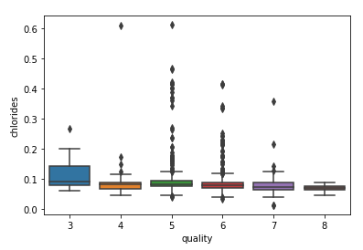

# Red_Wine_Predicition
Predicting Red Wine Rating as Bad(0), Good (1) or Exceptional (2) Given a Number of Characteristics

## Data Collection:  
Utilized a Data set available from Kaggle.

## Data Cleaning:  
Rounded some of the variables to clean up the data.

## EDA:  
<h3>In order to better understand some of the data, utilized some charts to visualize the data and distributions of the variables.</h3>  
<h4>Most of the variables followed a normal distribution with a few exceptions:</h4>  
    <ul><li>Volatile Acidity</li>
   <li>Citric Acid</li>
   <li>Alcohol</li></ul>
<h3> To better understand the relationship between the different variables, we can take a look at the a heatmap:</h3>  
  
<h3>From this we can see that a number of the variables have an impact on each other.</h3>  
<ul><li>pH and fixed acidity are closely related, which makes sense since changing the fixed acidity will directly effect the pH of the wine.</li>
<li>volatile acidity and citric acid are closely related, again this makes sense since citric acid will directly effect the volatile acidity.</li>
<li>citric acid and pH are also related, yet again this makes sense since the acid will directly effect pH.</li>
<li>chlorides and pH are closely related, this is likely due to the fact there are a number of basic substances that have chlorides as one of the components in the molecular structure.</li>
<li>density and alcohol are closely related also makes sense as the more alcohol reduces the density of the wine.</li></ul>
   
<h3>Checking the Box Plots for the different variables could help to give an understanding of the different outliers contained in the data:</h3>  
   <ul><li>Residual sugars stood out having quite a number of outliers in regards to quality:</li></ul>
        
        <ul><dl>This is somewhat explained by the large variance in residual sugars: min-0.9 and max- 15.5</dl></ul>  
   <ul><li>Chlorides also had a substantial amount of outliers:</li></ul>  
      
        <ul><dl>Again this could be explained by the large variance in chloride values: min- 0.012 and max- 0.611</dl></ul>
        
## Modeling:  
### Ran a number of models, and created confusion matrices for each model. After testing, the top three models without tuning were:  
**Random Forest Accuracy: 69.79**  
     
The Random Forest outperformed all the other models without tuning and correctly labeled 165 Bad wines as Bad, misrepreseted 46 Bad wines as Good and 2 Bad wine as Exceptional. It correctly attributed 131 Good wines in their respective category, mislabeled 51 Good wines as bad and 18 Good wines as Exceptional. The Exceptional Wines had 39 correctly categorized, 27 incorrectly categorized as Good and 1 categorized as Bad.
 
 
**Linear SVC Accuracy: 65.83**  
  
The Linear SVC Model correctly labeled under half of the Bad wines with only 81 being correctly categorized. 101 of the Bad wines were miscategorized under Good and 31 under Exceptional. The model correctly attributed 121 Good wines to its respective category, with 40 being miscategorized under Bad and 39 under Exceptional. In addition the model correctly categorized 18 Exceptional wines as Exceptional, 48 incorrectly under Good and 1 under Bad.
 
 
**Decision Tree Accuracy: 62.29**  
     
The Decision Tree Model placed 138 Bad wines in their correct category, 68 Bad wines were missclassified as Good and 7 Bad wine was misclassified as Exceptional. The model correctly assigned 123 Good wines to their correct category with 30 being misclassified as Exceptional and 47 misclassified as Bad. The Exceptional wines were mostly classified correctly with 38 Exceptional wines correctly categorized and 21 were misclassified under Good and 8 misclassified under Bad.
  
 
 ## Optimization:  
 Ran an optimization function: GridsearchCV to optimize the Random Forest model.
   
 This increased the accuracy up to to 70.42%. Following this, utilized pickle to pack the model in order to productionalize the model.
 
 ## Productionalizing:
 Established a Website which allows a user to input the characteristics of the wine and utilizes the optimized Random Forest Model to create a prediction for the input.

 
 

## Resources:  
Red Wine Data: https://www.kaggle.com/uciml/red-wine-quality-cortez-et-al-2009  
GridSearchCV: https://scikit-learn.org/stable/modules/generated/sklearn.model_selection.GridSearchCV.html  
Hypertuning: https://towardsdatascience.com/hyperparameter-tuning-the-random-forest-in-python-using-scikit-learn-28d2aa77dd74  
Django Tutorial: https://www.youtube.com/watch?v=e-ZJekJXGfI&t=1458s  
